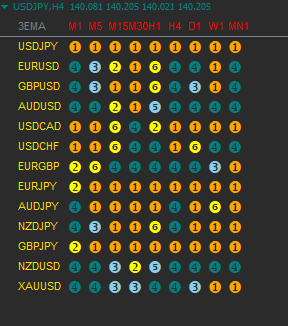
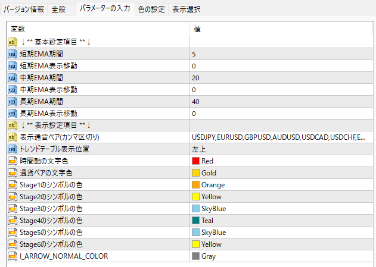

# 「大循環分析」環境認識用のインジケーター

## 概要

  

「小次郎講師」の「大循環分析」手法の環境認識用のインジケータです。
設定した通貨ペアの3本のEMAのステージの状況を一目で確認する事が出来ます。

## 入力パラメータ

* 短期EMA期間
* 短期EMA表示移動
* 中期EMA期間
* 中期EMA表示移動
* 長期EMA期間
* 長期EMA表示移動
* 表示通貨ペア  
    MT4の通貨ペアの表記をカンマ区切りで入力する。  
    MT4で取り扱いがない通貨ペアが入力された場合は処理を中断し、ログを出力する。  

## トレンド判定

各通貨ペアの時間足ごとに以下のシンボルを表示する。

* 「短期>中期>長期」の場合「①」を表示する(ステージ1)
* 「中期>短期>長期」の場合「②」を表示する(ステージ2)
* 「中期>長期>短期」の場合「③」を表示する(ステージ3)
* 「長期>中期>短期」の場合「④」を表示する(ステージ4)
* 「長期>短期>中期」の場合「⑤」を表示する(ステージ5)
* 「短期>長期>中期」の場合「⑥」を表示する(ステージ6)

## その他

### コンパイル時の注意点

このインジケーターは、MQL5の[Include\Generic\HashMap.mqh]をMQL4に移植して使用しています。  
コンパイルを行う場合は、[Include\Generic]ディレクトリをMQL4に取り込んでください。
